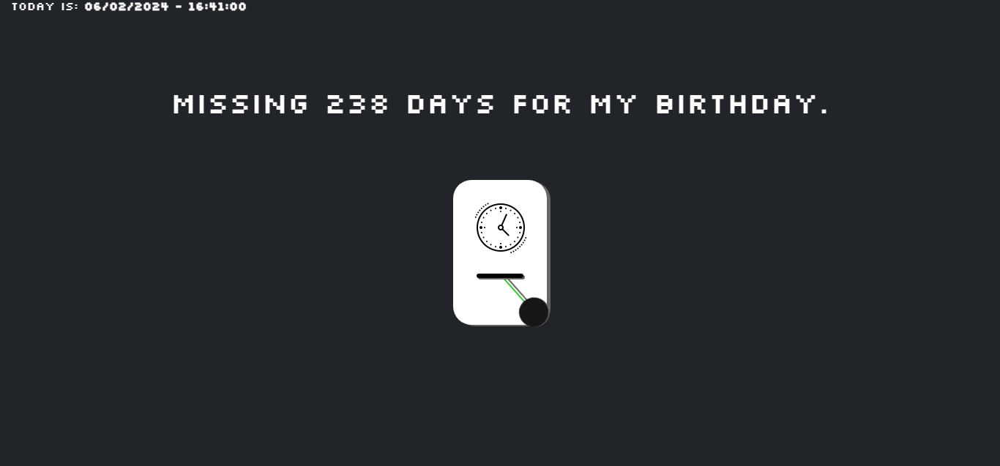

# aniv-days-counter-js
This is a simple JavaScript script to count the days until your birthday.



### How to use

1. Clone this repository to your computer - `git clone https://github.com/Luccxx/aniv-days-counter-js.git`

2. In the terminal, navigate to the directory where you cloned this repository.

3. Open the `index.html` file

### Personalization
You can customize the script to fit your birthday date. Just open the `counter-minutes.js` file and modify the `const birthday` variable to your birthday date:

```const birthday = new Date(`${year}-MM-DD`).getTime();```

**🚨 Make sure to keep the format 'YYYY-MM-DD' and the assignment `getTime()`.**

### Contributions
Contributions are welcome! Feel free to open issues or send pull requests to improve this script.

### License
This project is licensed under the MIT License.
